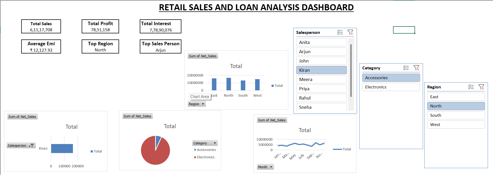

#  Retail Sales & Loan Analysis Dashboard

---

## Project Overview

This project is an interactive Excel dashboard developed to analyze retail sales and loan data using advanced Excel functions and data visualization techniques.

---

## Business Objective

The dashboard helps management monitor:

- Total Sales
- Total Profit
- Regional Performance
- Salesperson Performance
- Loan EMI and Interest Analysis

---

## Excel Functions Used

- VLOOKUP
- HLOOKUP
- RANK
- CONCAT
- IF
- IFS
- SUM
- DATE Functions
- PMT (Loan EMI)
- Simple Interest

---

## Dashboard Features

### KPI Cards
- Total Sales
- Total Profit
- Total Simple Interest
- Average EMI

### Pivot Table Analysis
- Region-wise Sales
- Category-wise Sales
- Monthly Sales Trend
- Salesperson Ranking

### Visualizations
- Line Chart
- Bar Chart
- Column Chart
- Pie Chart

---

## Dataset

- 1000 Retail Transactions
- Multiple Regions
- Multiple Products
- Customer Information
- Loan Data

---

## Skills Demonstrated

- Business Analytics
- Data Cleaning
- Dashboard Design
- Financial Analysis
- Data Visualization
- Microsoft Excel

---

## Author

**Adish Prasanth**

MBA (Operations & Business Analytics)

Interested in Supply Chain Analytics, Business Analytics, and Data Visualization.
